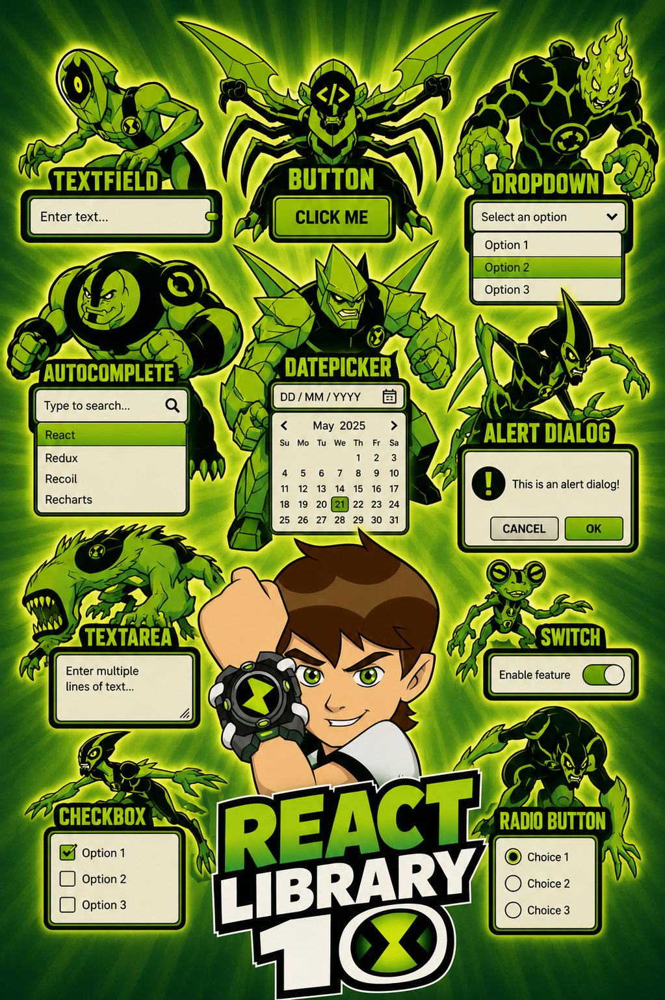

# 🚀 React Lib

<p align="center">
  
</p>

<p align="center">
A modern, lightweight and reusable React UI component library built with TypeScript.
Can be Use in ur project, with two way data flow.
</p>

---

## ✨ Features

- 🎨 Modern UI Components
- ⚡ Built with React & TypeScript
- 🧩 Easy to integrate
- 🎯 Reusable components
- 📱 Responsive design
- 🛠️ Fully customizable

---

## 📦 Installation

```bash
npm install @cs7player/react-lib
```

or

```bash
yarn add @cs7player/react-lib
```

---

## 🎨 Import Styles

```tsx
import '@cs7player/react-lib/styles.css';
```

---

## 🚀 Usage

```tsx
import '@cs7player/react-lib/styles.css';

import { Button, ButtonLib } from '@cs7player/react-lib';

function App() {
 const button = new Button('Click Me');
 return <ButtonLib button={button} />;
}

export default App;
```

---

## 📚 Available Components

- Button
- Text Field
- Checkbox
- Radio Button
- Time Picker
- Date Picker _(Coming Soon)_
- Label Header
- Alert
- Dialog _(Coming Soon)_
- Dropdown
- Switch
- Tooltip _(Coming Soon)_
- Autocomplete _(Coming Soon)_
- Loader _(Coming Soon)_

---

## 📖 Documentation

Documentation and examples will be available on GitHub.

Repository:

https://github.com/CS7player/x-library

---

## 🛠️ Development

Clone the repository:

```bash
git clone https://github.com/CS7player/x-library.git
```

Install dependencies:

```bash
npm install
```

Run library locally:

```bash
npm run build
npm link
--in ur local project--
npm link @cs7player/react-lib
```

---

## 🤝 Contributing

Contributions are welcome!

1. Fork the repository.
2. Create a feature branch.
3. Commit your changes.
4. Open a Pull Request.

---

## 📄 License

This project is licensed under the MIT License - see the [LICENSE](LICENSE) file for details.

---

## 👨‍💻 Author

**Chandra Sekhar**

GitHub: https://github.com/CS7player
